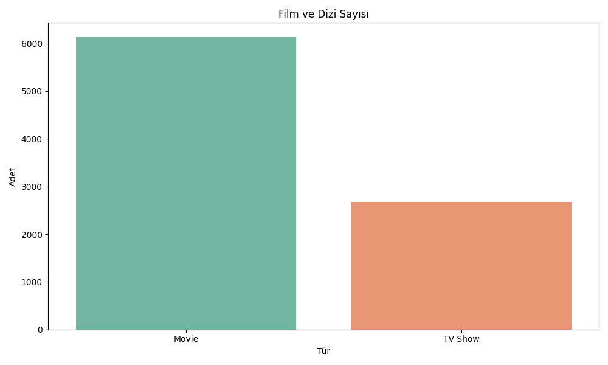
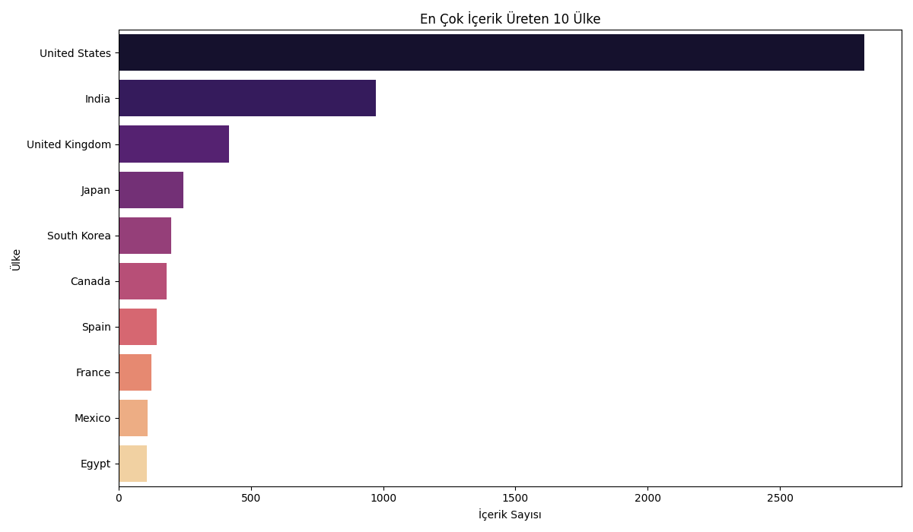

# 🎬 Netflix Global Content Analysis

This project analyzes over 8,000 titles from the Netflix library to visualize production trends and country-based production rates.

## 📊 Key Insights
* **Content Type:** Movies significantly outnumber TV shows on the platform.
* **Production Hub:** The **United States** is the leading content producer, followed by **India**.
* **Peak Year:** Content additions reached their all-time high in **2018**.

## 📈 Visualizations
### 1. Movie vs TV Show Distribution

### 2. Content Release Trends

### 3. Top 10 Content Producing Countries

## 🛠️ Tech Stack
* **Python**
* **Pandas** (Data Manipulation)
* **Seaborn & Matplotlib** (Visualization)
